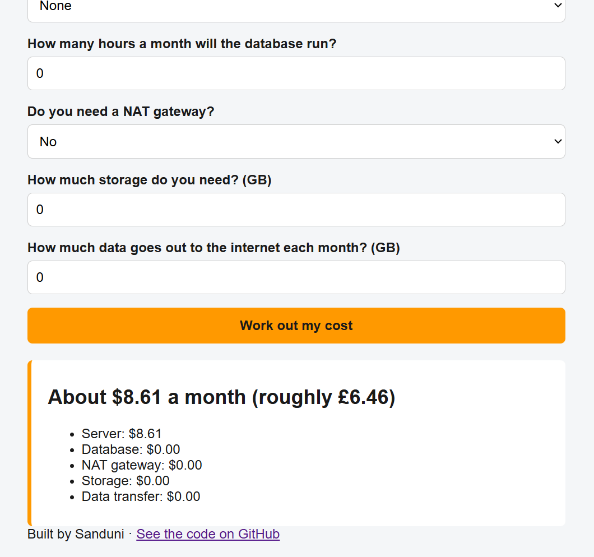

# Bill Guard — roughly what will this AWS setup cost me?

**A live tool that answers the question I was scared of in my first week on AWS.**

👉 **Try it:** https://d2j172kdih1qlm.cloudfront.net

Built by Sanduni · September 2026 · AWS Certified Cloud Practitioner

---

## 1. The problem (business story)

People new to AWS are frightened of one thing: a surprise bill. The pricing pages are long and written for people who already understand them.

I was that person. In my first weeks on AWS, I deleted everything at the end of every session and checked the Billing page every morning.

Bill Guard asks five plain questions and gives one clear answer: roughly this much a month, at full price, and here is what costs the most.

It deliberately does **not** calculate the free tier. AWS changed the free tier rules on 15 July 2025 (new accounts now get credits, not free hours). A tool that guessed your discount would be wrong for someone. Full price is true for everyone.



---

## 2. Architecture

```
Visitor
   │
   ▼
CloudFront ──── delivers the page fast, gives HTTPS
   │
   ▼
S3 bucket ───── holds the web page (private — only CloudFront can read it)
   │
   ▼ (the page sends the five answers)
API Gateway ─── the front door to my code, with throttling on
   │
   ▼
Lambda ──────── my Python, works out the cost and the warnings
   │
   ▼
DynamoDB ────── counts how many times the tool has been used
```

No servers. Nothing runs when nobody is using it, and nothing is billed either.

---

## 3. Services and why

| Service | Why it is here |
|---|---|
| **CloudFront** | Delivers the page from edge locations near the visitor, and gives HTTPS for free. It is also the only way into my bucket. |
| **S3** | Holds one file, `index.html`. No web server needed. |
| **API Gateway** | Gives my code a web address. Throttling is turned on (5 requests a second, burst 10). |
| **Lambda** | Runs my Python only when someone clicks the button. |
| **DynamoDB** | One row, one counter. Adds 1 every time the tool is used. |

**The code:**

- `bill_rules.py` — the pricing logic. Small functions, one job each. Prices in one place at the top.
- `test_bill_rules.py` — 11 automated tests (pytest): 0 hours, a full month, NAT gateway alone, bad input, negative numbers.
- `lambda_function.py` — the thin wrapper that AWS calls. It passes the answers to `assess()` and updates the counter.
- `index.html` — the form, the JavaScript that calls the API, and the styling.

Python 3.14 on my laptop and in Lambda, so what passes at home passes in the cloud.

Prices checked against the AWS pricing pages for Europe (London), eu-west-2, on 15 September 2026.
On 18 September 2026 I re-checked the NAT gateway price by hand: $0.05 an hour × 730 hours = $36.50, which matches my tool.

This is an estimate to help people plan. It is not official AWS pricing.

---

## 4. Why serverless, when Project 1 used servers

My first project ([aws-resilient-shop](https://github.com/sanduaws17767-oss/aws-resilient-shop)) was a 3-tier web app: a load balancer, EC2 servers with Auto Scaling, and an RDS database. This project has no servers at all. Having built both, this is how I compare them.

**What each one costs at 3 a.m., when nobody is using it**

Project 1 costs money every hour, even with no visitors. The EC2 servers, the load balancer and the RDS database all charge just for existing.
Project 2 costs almost nothing when idle. Lambda only charges when someone clicks. The only standing cost is a few pennies of S3 storage.

**What happens if 1,000 people arrive at once**

Project 1 scales by adding servers, which takes minutes. The first rush can be slow.
Project 2 scales by itself in seconds. But I capped it with throttling at 5 requests a second, so a flood gets turned away instead of running up my bill. For a real business, I would raise that limit.

**When I would pick each one**

- Servers: when the app needs to run all the time, needs a full database, or needs long-running work.
- Serverless: when traffic is small or comes in bursts, and I want to pay only for what is used.

---

## 5. Trade-offs I considered

- **Full price only vs calculating the free tier.** Full price is true for everyone. The free tier depends on your account and runs out. I chose the number that is never wrong.
- **Private S3 bucket + Origin Access Control (OAC) vs a public website bucket.** I kept the bucket private. Only my CloudFront distribution can read it. The direct S3 link returns Access Denied. One extra screen, and it is the answer an architect gives.
- **CloudFront pay-as-you-go vs the Free flat-rate plan.** The console created the distribution as pay-as-you-go. At my traffic it sits inside the always-free allowance. Switching to the Free flat-rate plan is on my improvement list.
- **No AWS WAF (Web Application Firewall).** The console pre-selected it, with an estimated cost. I turned it off. My page is one static file, and my API is already protected by throttling. For a real app with logins or payments, I would turn it on.
- **Hard-coded prices vs the AWS Price List API.** Hard-coded prices are simple and testable, but they go stale. I wrote the date I checked them into the file.
- **DynamoDB vs no database.** I only need one counter, but a live usage number is proof that real people used the tool.
- **One Lambda vs several.** One function is enough for one job. Splitting it would add complexity with no benefit.

---

## 6. What broke and how I fixed it

- **Negative hours quietly lowered the bill.** Typing -5 hours gave a smaller total instead of an error. I wrote a failing test first, watched it go red, added a check in `assess()`, and watched it go green.
- **My own warning said the opposite of what I meant.** The NAT gateway warning said "only delete it if you don't need it". I rewrote it: the only way to stop paying for a NAT gateway is to delete it.
- **CORS errors when testing from my laptop.** I opened `index.html` by double-clicking it. A page opened from disk has origin `null`, so the browser blocked every call to my API before it was sent. I served the page from a local web server (`python -m http.server`) instead, and it worked.
- **My update did not show on the live site.** CloudFront had cached the old page. I created an invalidation for `/*` so every edge location fetched the new copy. Then I found the real problem: I had never actually uploaded the new file to S3.
- **AWS WAF was pre-selected during CloudFront setup.** I stopped, read the price estimate, and chose "Do not enable security protections".

**What I found when I tried to break my own tool**

- Empty box → clear message.
- Words in a number box → the browser blocks them before they are sent.
- Negative numbers → clear message (added after I found the bug above).
- 99,999,999 hours → it gave an answer of over a million dollars. A month only has 730 hours. Fixing this is first on my improvement list.

---

## 7. What it costs to run

Roughly £0 a month at this level of use.

- Lambda, API Gateway, DynamoDB and CloudFront all sit inside the always-free allowances at this traffic.
- S3 holds one small file: less than a penny.
- Throttling is on, so a flood of requests cannot run up a bill.

My AWS account is on the Free plan, which ends in February 2027. I have a reminder set for mid-January 2027 to upgrade to the paid plan and set a £5 budget alarm the same day, so the link stays live.

---

## 8. What I'd improve next

- Reject more than 730 hours in a month.
- Move the CloudFront distribution to the Free flat-rate plan, which includes WAF at no cost.
- Pull live prices from the AWS Price List API instead of hard-coding them.
- Cover more services (for example, Application Load Balancer and Lambda itself).
- Count unique visitors, not just clicks.

---

## 9. What real users told me

I sent the link to 10 people in 4 countries: the UK, Sri Lanka, Canada and Australia. I asked one question: "Was anything confusing?"

- All 10 said the tool worked on their phones.
- One friend in Australia sent me a screenshot of her result.
- The tool has been used 29 times in its first day, counted in DynamoDB (this includes my own testing).

Because CloudFront serves the page from edge locations near each visitor, my friends in Australia, Sri Lanka and Canada were not waiting on a server in London.

